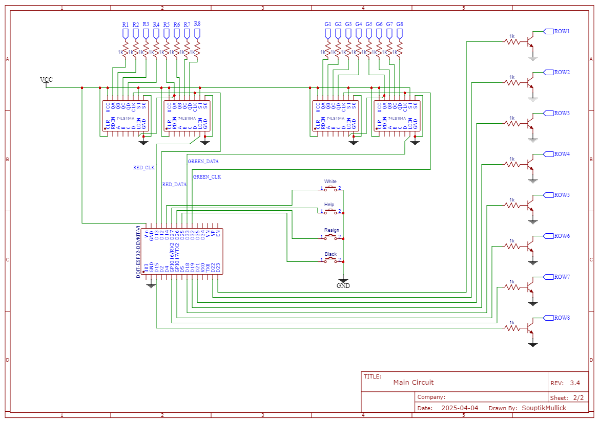
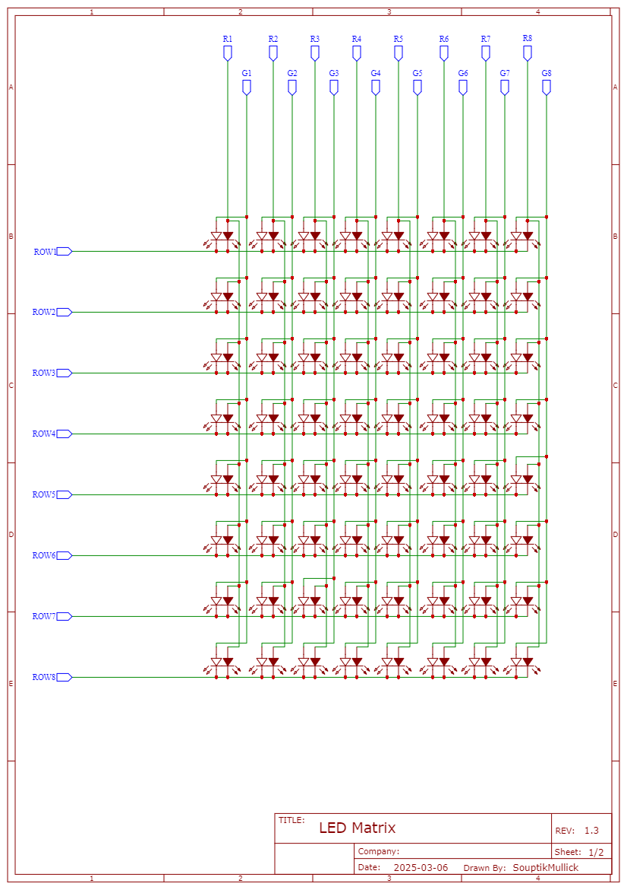

# A microcontroller-based chessboard with visual feedback

This project provides a GUI interface for controlling a chessboard with automated LED indicators. It uses CustomTkinter for the GUI, OpenCV for camera input, python-chess for chess logic, and serial communication with an ESP32 microcontroller to control LEDs on the chessboard.

## Features
- CustomTkinter-based GUI
- OpenCV-based camera input and board detection
- python-chess for chess logic and move validation
- Serial communication with ESP32 for LED control
- Asset management for icons, images, and themes
- Portable executable packaging with PyInstaller

## Project Structure
```
MAIN.py                # Main application entry point
src/                   # Source code modules
assets/                # Images, icons, and theme files
firmware/              # ESP32 firmware (.ino file)
Circuits/              # Circuit diagrams and related images
build/, dist/          # PyInstaller output (ignored by git)
ChessBot.spec          # PyInstaller spec file
.gitignore             # Git ignore rules
```

## Getting Started
1. Install dependencies:
   ```sh
   pip install -r requirements.txt
   ```
2. Run the application:
   ```sh
   python MAIN.py
   ```
3. To build a standalone executable (Windows):
   ```sh
   pyinstaller --onefile --windowed --icon=assets/ICON.ico MAIN.py
   ```

## Version Control
- Only source code, assets, and configuration files are tracked.
- Build artifacts, virtual environments, and temporary files are ignored (see `.gitignore`).

## Hardware & Circuit
- The `firmware/` folder contains the ESP32 code for LED control.
- Circuit diagrams are in the `Circuits/` folder:
  
  

## License
Specify your license here.
